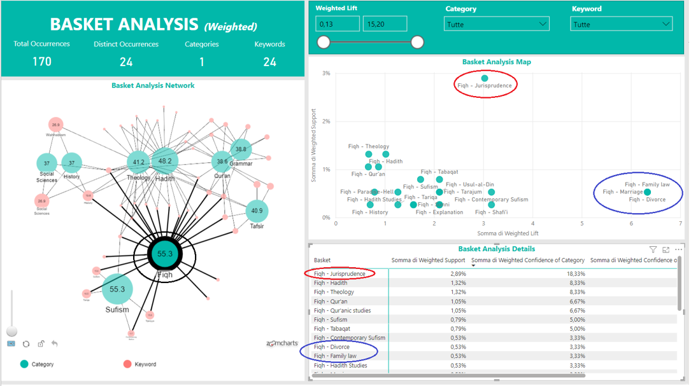

# 📊 Power BI Basket Analysis

A Power BI project for association analysis between **categories** and **keywords** using **Support, Confidence, and Lift** metrics.

## 🚀 Description
This report implements a **Basket Analysis** on a dataset of books, calculating key metrics to understand relationships between categories and keywords.

🔹 **Technologies Used**:
- Power BI
- DAX
- Dataset of books with categories and keywords

## 📂 Repository Contents
- `basket-analysis.pbix` → The complete Power BI file **(if you want to share the data)**.
- `basket-analysis.pbit` → The Power BI template **(without data, lighter version)**.
- `DataSet_MaKtaba.xlsx` → Sample dataset used for analysis.
- `ITA - Market Basket Analysis in PowerBI.pptx` → Presentation in Italian language of the methodology and results. 

## 📈 Metrics Calculated
This analysis includes:
- **Support** → Frequency with which a category-keyword pair appears in the dataset.
- **Confidence** → Probability that a category/keyword appears given that the other is present.
- **Lift** → Strength of the relationship between a category and a keyword.

## 🛠️ How to Use
1. Download the **`.pbix`** file or the **`.pbit`** template.
2. Open it in Power BI Desktop.
3. If using the `.pbit` file, connect your dataset and refresh the report.

## 📸 Report Preview

